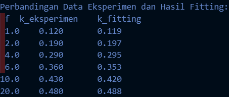

# Curve Fitting Model Saturasi (Monod) untuk Data Pertumbuhan Mikroorganisme

## :bulb: Deskripsi Program

Program ini merupakan implementasi metode numerik untuk melakukan curve fitting atau regresi nonlinier pada data pertumbuhan mikroorganisme menggunakan model saturasi (Monod). Dengan memasukkan data eksperimen berupa konsentrasi substrat dan laju pertumbuhan, program akan mencari parameter terbaik, yaitu laju pertumbuhan maksimum (`kmax`) dan konstanta setengah saturasi (`K`), yang meminimalkan error antara model dan data aktual.

### :cyclone: Fitur Utama
- Mengestimasi parameter model saturasi (Monod) secara otomatis dari data eksperimen.
- Menghitung dan menampilkan error total (sum of squared error) antara hasil fitting dan data asli.
- Menampilkan tabel perbandingan antara data eksperimen dan hasil fitting untuk setiap titik.
- Sederhana, mudah digunakan, dan dapat diperluas untuk data dan model lain.

### :mag_right: Kegunaan Program
Program ini sangat bermanfaat dalam analisis proses bioproses, terutama untuk:
- Validasi model matematis pertumbuhan mikroorganisme pada proses fermentasi.
- Prediksi laju pertumbuhan berdasarkan konsentrasi substrat dalam kondisi nyata.
- Dasar optimasi penggunaan nutrisi pada skala laboratorium maupun industri.

### :notebook: Cara Kerja
1. Pengguna memasukkan data eksperimen berupa pasangan konsentrasi substrat dan laju pertumbuhan.
2. Program menjalankan algoritma grid search untuk mencari nilai `kmax` dan `K` yang optimal.
3. Hasil fitting dan perbandingan dengan data eksperimen ditampilkan pada output.

### :page_facing_up: Bahasa & Dependensi
- Bahasa pemrograman: **C**
- Tidak membutuhkan library eksternal tambahan

### :rocket: Contoh Output
